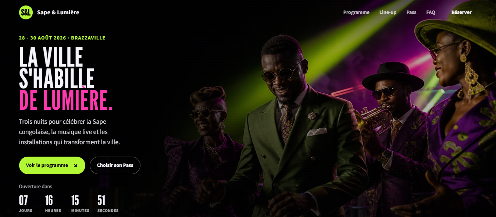
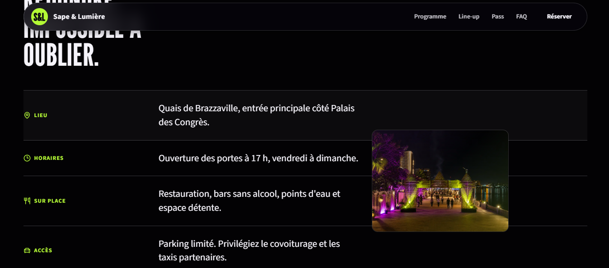

# Festival Sape & Lumière

Festival Sape & Lumière est une landing page événementielle immersive pour une édition de trois jours à Brazzaville. Le projet met en avant la Sape congolaise, la musique live et les installations lumière, avec une expérience pensée pour le desktop comme pour le mobile.





## Démo

- GitHub Pages : https://osiris-balonga.github.io/sape-and-light-festival/
- Repository : https://github.com/Osiris-Balonga/sape-and-light-festival

## Fonctionnalités

- Présenter le festival dans une bannière plein viewport avec un compte à rebours dynamique
- Naviguer entre les trois journées du programme grâce à des onglets accessibles au clavier
- Filtrer le line-up par musique, mode & Sape ou art lumière
- Afficher les artistes et les partenaires avec leurs visuels optimisés
- Réserver un Pass ou envoyer une demande préremplie vers WhatsApp
- Valider le formulaire de contact côté client avec des messages d'erreur explicites
- Ouvrir une FAQ animée et accessible
- Faire apparaître un aperçu visuel contextuel au survol des informations pratiques sur desktop
- Adapter la navigation, la typographie et les interactions aux écrans tactiles
- Respecter la préférence `prefers-reduced-motion`

## Lancer le projet

Démarrer le serveur statique inclus :

```bash
node scripts/serve.mjs
```

Puis visiter `http://localhost:4173`.

## Organisation du code

```text
sape-and-light-festival/
|-- assets/
|   |-- css/
|   |   |-- base.css
|   |   |-- components.css
|   |   |-- responsive.css
|   |   `-- tokens.css
|   |-- images/
|   |   |-- artists/
|   |   |-- hero/
|   |   |-- partners/
|   |   |-- practical/
|   |   `-- previews/
|   `-- js/
|       `-- main.js
|-- scripts/
|   `-- serve.mjs
|-- .nojekyll
|-- index.html
`-- README.md
```

`tokens.css` centralise les variables de couleur, d'espacement, de typographie et de profondeur. `components.css` porte les composants visuels, tandis que `responsive.css` contient les adaptations aux différentes tailles d'écran. `main.js` orchestre les interactions : compte à rebours, navigation, onglets, filtres, FAQ, formulaire et aperçus pratiques.

## Technologies

- HTML5 sémantique
- CSS natif avec Grid, Flexbox, propriétés personnalisées et media queries
- JavaScript natif
- [Lucide](https://lucide.dev/) pour les icônes
- Google Fonts : League Gothic et Source Sans 3

## Déploiement GitHub Pages

Le site est publié depuis la branche `main` et le dossier racine. Le fichier `.nojekyll` évite le traitement Jekyll afin de conserver les fichiers statiques tels quels.

## Auteur

Projet réalisé par [Osiris Balonga](https://github.com/Osiris-Balonga) dans le cadre de l'Akieni Academy.
